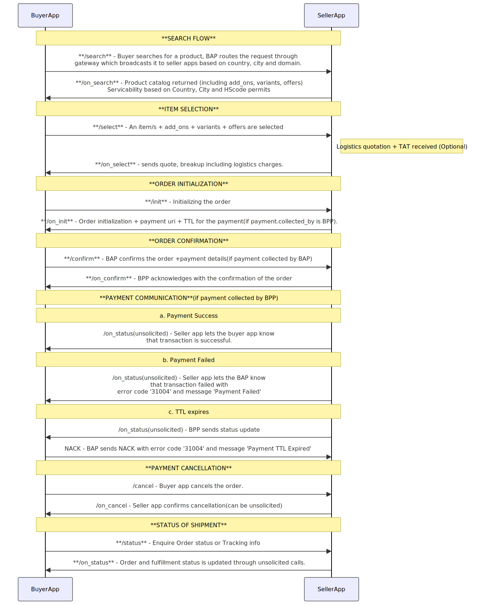

# B2B Non-RFQ Flow

In the B2B (Business-to-Business) construct, the Non-RFQ flow is a straightforward process. Here, the buyer can select items from the catalog and confirm the order based on the prices defined in the catalog without customizations and negotiated cart value. The key steps in the Non-RFQ flow are:

## Search & Discovery
- The buyer initiates a search request through the Buyer App (BAP).
- The Gateway broadcasts this request to relevant seller apps (BPPs) based on country, domain, and city parameters.
- Seller apps respond with an "on_search" callback response containing a product catalog, add-ons, variants, offers, etc.

## Selection of items
- Buyer selects the items and customizations from the catalog and the seller app responds with a detailed quote, providing a breakdown that includes logistics charges (In case delivery is required) and a TTL for which this quote will be valid.

## Order Initialization
- The buyer initializes the order through /init request by providing billing details and the precise delivery address.
- A subsequent /on_init callback response is sent acknowledging the same and payment gateway link is provided by the seller app.

## Order confirmation
- The buyer app confirms the order using /confirm call and seller app accepts it via /on_confirm callback response.

## Payment Process
- The payment process varies depending on whether the payment is prepaid or on-fulfillment and whether it is collected by the Buyer App (BAP) or the Seller App (BPP).
- If payment is prepaid and collected by BAP, buyer app updates the payment details through /confirm call.
- If payment is prepaid and collected by BPP, the payment status is communicated to BAP through an /on_status call.
- If payment is on-fulfillment, then the BPP updates the payment status once the order is delivered.

## Order Status Inquiry
- The buyer has the option to inquire about the status of the transaction by sending a "status" request for order status.
- The BPP responds with an "on_status" callback response until order is delivered.

<!--  -->

