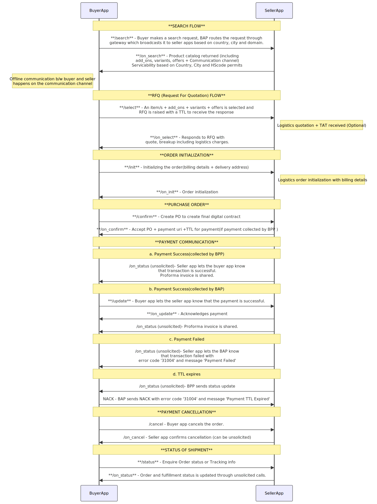

# B2B RFQ Flow

The Request For Quotation (RFQ) flow is a systematic process within a B2B (Business-to-Business) environment where a buyer engages with a seller to discuss customizations, add_ons, and other details related to a potential purchase and then raises a Purchase Order (PO) for the same. The key steps in the RFQ flow are as follows:

## Search & Discovery
- The buyer initiates a search request through the Buyer App (BAP).
- The Gateway broadcasts this request to relevant seller apps (BPPs) based on country, domain, and city parameters.
- Seller apps respond with an "on_search" callback response containing a product catalog, add_ons, variants, offers, and an optional communication channel link for buyer-seller interactions.
- In case communication channel link is not provided by the seller app, buyer app can send its own link in the /select call.

## Communication and Customization
- The buyer and seller engage in discussions through the provided communication channel.
- Customizations, add_ons, and other specific details related to the purchase are discussed and finalized.

## Request For Quotation (RFQ)
- After discussions, the buyer requests a formal quotation of the items and customizations discussed (BUYER_TERMS) from the seller.
- Buyer app initiates a "select" request which includes a TTL, indicating the duration by which the buyer expects a response with the quotation.

## Quotation Response
- The seller app responds with /on_select with a detailed quote, providing a breakdown that includes logistics charges (In case delivery is required) and a TTL for which this quote will be valid.

## Order Initialization
- Upon reviewing the quotation and reaching an agreement, the buyer initializes the order through /init request by providing billing details and the precise delivery address.
- A subsequent /on_init callback response is sent acknowledging the same. 

## Purchase Order (PO)
- The buyer app proceeds to create a formal Purchase Order (PO) using /confirm call and seller app accepts/rejects it via /on_confirm callback response.

## Payment Process
- The payment process varies depending on whether the payment is prepaid or on-fulfillment and whether it is collected by the Buyer App (BAP) or the Seller App (BPP).
- If payment is prepaid and collected by BAP, an /update call is sent to the BPP updating the payment details.
- If payment is prepaid and collected by BPP, the payment status is communicated to BAP through an /on_status call.
- If payment is on-fulfillment, then the BPP updates the payment status once the order is delivered.

## Order Status Inquiry
- Seller app provides the proforma invoice through unsolicited /on_status call.
- The buyer has the option to inquire about the status of the transaction by sending a "status" request for order status.
- The BPP responds with an "on_status" callback response until order is delivered.

<!--  -->

